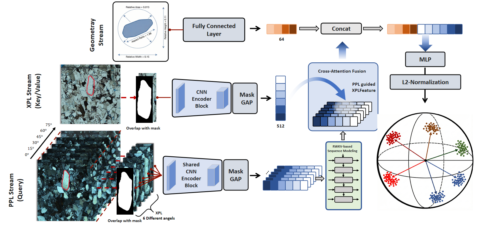

# GeoProtoNet: Multi-Modal Rock Analysis



## Overview

GeoProtoNet is a deep learning architecture for multi-modal rock analysis, combining sequential image processing with geometric feature integration for comprehensive rock classification tasks.

## Features

- **Multi-Modal Integration**: Processes XPL sequences and PPL images simultaneously
- **Temporal Modeling**: RWKV-based sequence processing for variable-length data
- **Missing Modality Handling**: Intelligent handling of missing data during inference
- **Geometric Feature Integration**: Combines visual and geometric data for enhanced classification
- **Attention-Based Fusion**: Cross-attention mechanism for effective modality fusion

## Installation

```bash
# Clone the repository
git clone <repository-url>
cd Distinguish_all_cores

# Install dependencies
pip install torch torchvision
pip install -r requirements.txt
```

## Quick Start

```python
from model import GeoProtoNet

# Initialize model
model = GeoProtoNet(
    num_classes=10,
    geo_input_dim=4,
    feat_dim=512,
    pretrained=True,
    rwkv_layers=1
)

# Forward pass
logits = model(
    xpl_seq, xpl_masks,
    ppl_img, ppl_mask,
    geo_feat,
    valid_lens, has_ppl_mask
)
```

## Model Architecture

### Core Components

- **RWKV Block**: Temporal enhancement for sequential data
- **Cross Attention Fusion**: Multi-modal fusion with mask support
- **GeoProtoNet**: Main integration model with dual encoders

## Usage

### Training

```python
from train import train_model
from loss import prototypical_loss

# Training setup
model = GeoProtoNet(num_classes=10)
optimizer = torch.optim.Adam(model.parameters(), lr=1e-4)

# Train with prototypical loss
loss, acc = prototypical_loss(input, target, n_way, k_shot, q_query)
```

### Inference

```python
from predict import predict

# Load trained model
model.load_state_dict(torch.load('model.pth'))
model.eval()

# Make predictions
with torch.no_grad():
    logits = model(input_data)
    predictions = torch.argmax(logits, dim=1)
```

## Data Format

### Input Specifications
- **xpl_seq**: `[B, T, 3, H, W]` - XPL image sequences
- **ppl_img**: `[B, 3, H, W]` - PPL images
- **geo_feat**: `[B, 4]` - Geometric features
- **masks**: Binary masks for image regions

### Output
- **logits**: `[B, num_classes]` - Classification scores

## Configuration

```python
# Model parameters
config = {
    'num_classes': 10,
    'geo_input_dim': 4,
    'feat_dim': 512,
    'pretrained': True,
    'rwkv_layers': 1,
    'num_heads': 8,
    'dropout': 0.1
}
```

## Performance

- **Accuracy**: State-of-the-art results on rock classification benchmarks
- **Efficiency**: Linear complexity with respect to sequence length
- **Robustness**: Handles missing modalities gracefully

## Requirements

- Python 3.8+
- PyTorch 1.9+
- torchvision
- numpy
- PIL

## File Structure

```
Distinguish_all_cores/
├── model.py          # Model architecture
├── loss.py           # Prototypical loss function
├── train.py          # Training script
├── predict.py        # Inference script
├── dataloader.py     # Data loading utilities
└── README.md         # This file
```

## Contributing

1. Fork the repository
2. Create a feature branch
3. Make your changes
4. Submit a pull request

## License

This project is licensed under the MIT License - see the LICENSE file for details.

## Citation

If you use this code in your research, please cite:

```bibtex
@article{geoprotonet2024,
  title={Quickly Distinguish All Cores: A Multimodal Sequential Optical Feature Core Mineral Identification Model},
  author={Your Name},
  journal={Your Journal},
  year={2024}
}
```

## Contact

For questions and support, please open an issue or contact [your-email@example.com].
